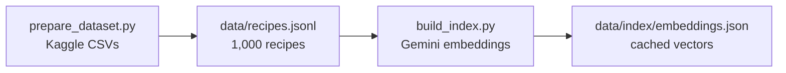
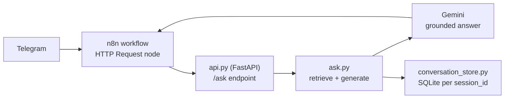

# Recipe RAG — Telegram Cooking Assistant

A retrieval-augmented generation (RAG) pipeline, wrapped as a Telegram bot,
that answers everyday cooking questions using only a real recipe collection —
no invented recipes, no generic internet answers.


**Status:** Studi kasus teknis / proyek personal — dibangun untuk mengeksplorasi desain RAG
tanpa vector database, dipakai untuk kebutuhan pribadi lewat Telegram.

---

## Table of Contents

- [Problem](#problem)
- [Solution](#solution)
- [Result](#result)
- [Setup](#setup)
- [Project layout](#project-layout)
- [Known limitations](#known-limitations)
- [License](#license)

---

## Problem

"What can I cook with the tempe I already have?" is a question worth asking a
bot instead of a search engine, but only if the bot actually looks at a real
recipe collection instead of hallucinating a plausible-sounding one. A plain
LLM call can't see any particular collection and will happily invent
ingredients or steps that don't exist. I wanted a pipeline that grounds every
factual claim in a real document set, reachable from Telegram, that admits
"not in my collection" instead of guessing — and that behaves like an actual
assistant (chit-chat, follow-up questions, picking from a shortlist) rather
than a one-shot search box that dumps a wall of links.

## Solution

Three pieces, kept separate and composable rather than one script that does
everything:

1. **`tools/prepare_dataset.py`** — samples the Kaggle
   [`canggih/indonesian-food-recipes`](https://www.kaggle.com/datasets/canggih/indonesian-food-recipes)
   dataset (8 categories scraped from Cookpad Indonesia, CC0-1.0) down to the
   125 most-loved recipes per category into `data/recipes.jsonl` — 1,000
   recipes total, each keeping its Cookpad source URL for attribution.
2. **`tools/build_index.py`** — embeds every recipe with Gemini's
   `gemini-embedding-001` and caches the vectors to
   `data/index/embeddings.json`. Resumable by recipe id: re-running it only
   embeds genuinely new rows, and backfills new metadata fields (like
   `category`) onto already-cached entries for free, with no repeat API
   calls.
3. **`tools/ask.py`** / **`tools/api.py`** — the retrieval + generation
   logic, either as a CLI (`ask.py`, for manual testing) or as a small
   FastAPI service (`api.py`) that an n8n workflow calls over HTTP so the
   Telegram integration, hosting, and credentials stay in n8n while the RAG
   logic stays in Python.





Two retrieval decisions worth calling out:

- **No vector database.** Retrieval is brute-force cosine similarity over a
  flat JSON file (plain NumPy) — no pgvector/Chroma/FAISS. At 1,000 recipes
  this is comfortably under 50ms per query in memory. A real vector DB would
  only start to earn its complexity if this collection grew by an order of
  magnitude or more.
- **No chunking.** Each recipe is embedded whole (title + ingredients +
  steps). A recipe is an atomic answer unit — splitting ingredients from
  steps would produce fragments that can't stand on their own, unlike a
  long multi-section document where chunking earns its keep.
- **Category as a free metadata filter.** The dataset already carries a
  `category` field (ayam, ikan, kambing, sapi, tahu, telur, tempe, udang —
  125 recipes each). `detect_category()` in `ask.py` does a plain keyword
  match against the question; when exactly one category matches, retrieval
  narrows to that ~125-recipe subset and pulls a wider candidate pool
  (`top_k_category`) before ranking by similarity. Without this, a broad
  question like "I have tempe, what can I cook?" would silently surface only
  3 of the ~150 tempe recipes with no signal that more exist.

The system prompt (`config/rag_config.json`) is instructed to list the
matching recipe *titles* and ask which one the user wants, rather than
either blending steps from several recipes into one answer or picking one
arbitrarily — the shortlist itself is grounded in the actual retrieved
titles, never invented.

For the Telegram bot specifically, `tools/api.py` accepts an optional
`session_id` (the Telegram chat id) and keeps the last few question/answer
turns per session in `data/state/conversations.db` (SQLite), so a follow-up
like "yang oreg tempe aja deh, gimana caranya?" resolves against what was
actually just discussed instead of being treated as an unrelated new
question.

Everything tunable — models, `top_k`, category keywords, history length, the
grounding/behavior instructions — lives in `config/rag_config.json`, not
hardcoded in the scripts.

### Why Gemini instead of Claude

The original plan used Claude Haiku for generation. I dropped that: a Claude
Pro subscription is billed completely separately from the Anthropic API, so
using Claude here would have meant a new, separate paid API account just for
a personal project. Gemini's free tier already covers both embeddings and
generation, so the whole pipeline runs on Gemini end to end.

## Result

Real run against the live 1,000-recipe collection:

```
$ python tools/ask.py "saya punya tempe di rumah, enaknya dimasak apa ya?" --show-sources
Sumber yang diambil:
  - Tempe Goreng Telur (skor=0.730)
  - Tempe Goreng Telur (skor=0.729)
  - Tempe Goreng Telur (skor=0.727)
  - Tempe Melet (skor=0.727)
  - Tempe Melet (skor=0.726)
  - Oreg tempe (skor=0.725)
  - Tempe kriuk instan by Sii Trias💓 (skor=0.725)
  - Tempe isi Sambel (skor=0.725)

Halo! Wah, asyik banget punya stok tempe di rumah. [...] Berikut adalah
daftar judul resep yang bisa kamu pilih:

1. Tempe Goreng Telur (Sumber: https://cookpad.com/id/resep/4252407-...)
2. Tempe Goreng Telur (Sumber: https://cookpad.com/id/resep/4029038-...)
...
8. Tempe isi Sambel (Sumber: https://cookpad.com/id/resep/4251330-...)

Kira-kira kamu lagi pengen coba bikin resep yang mana nih?
```

Follow-up in the same Telegram chat (`session_id` carried over):

```
User: yang oreg tempe aja deh, gimana caranya?

Wah, pilihan yang pas banget! [...] ini dia bahan-bahan dan langkah lengkap
untuk membuat Oreg tempe (Sumber: https://cookpad.com/id/resep/4448232-...):

Bahan-bahan:
- 500 gr tempe
- 5 buah cabe ije ...
[...]
```

And the grounding check — a question with genuinely no match returns a
plain refusal instead of a fabricated recipe, citing the collection, not
guessing from general knowledge.

## Setup

```bash
python -m venv .venv
.venv\Scripts\activate      # Windows
pip install -r requirements.txt
```

Copy `.env.example` to `.env` and fill in a Gemini API key from
[Google AI Studio](https://aistudio.google.com/apikey):

```
GEMINI_API_KEY_RAG=your-key-here
```

Build the index (the pre-sampled `data/recipes.jsonl` is already checked in,
so this just embeds it — no Kaggle download needed unless you want to
resample):

```bash
python tools/build_index.py
python tools/ask.py "resep apa yang bisa dibuat dari telur?"
```

### Running the Telegram bot

The bot itself is an n8n workflow (Telegram trigger → HTTP call to the
Python API → reply), not part of this repo. This repo only ships the API
side:

```bash
docker compose up -d --build
```

This builds and runs `tools/api.py` on port 8000, on the same Docker network
as the n8n instance, with `data/state/` mounted as a volume so conversation
history survives a redeploy. The n8n workflow's HTTP Request node points at
`http://recipe-api:8000/ask` and forwards the Telegram `chat.id` as
`session_id`.

## Project layout

```
config/rag_config.json     # models, top_k, category keywords, history length, system prompt
data/recipes.jsonl          # 1,000 sampled recipes (source data, checked in)
data/index/                 # cached embeddings, rebuilt by build_index.py
data/state/                 # conversation history (SQLite, gitignored — real user data)
tools/prepare_dataset.py    # Kaggle CSVs -> data/recipes.jsonl
tools/build_index.py        # embed recipes -> cache
tools/ask.py                 # CLI: retrieve + generate an answer
tools/api.py                 # FastAPI wrapper for the Telegram bot (n8n calls this)
tools/conversation_store.py # per-session Q/A history for follow-up questions
tools/_common.py             # shared env/config/Gemini API helpers
workflows/ask_recipe.md      # SOP for this pipeline
Dockerfile, docker-compose.yml  # container for tools/api.py
```

## Known limitations

- **Category detection is a plain keyword match**, not real intent
  understanding. "Tempe atau ayam?" mentions two categories and falls back to
  plain semantic search across all 1,000 recipes rather than picking one.
- **No hard relevance threshold.** Retrieval always returns its top-k
  nearest vectors, even when nothing is truly relevant; refusal relies on
  the system prompt's instruction rather than a similarity cutoff.
- **Conversation history is capped at 50 stored turns per session** and
  only the most recent `history_turns` (default 6) are fed into any given
  answer — a long-running chat will lose earlier context, by design, to
  keep the prompt small.
- **Not a real vector database, and not chunked** — see the rationale under
  Solution. Both are deliberate choices for a 1,000-recipe, whole-document
  collection, not omissions.
- **In Indonesian.** Recipes and answers are in Indonesian since that's the
  actual daily-use case; the system prompt and model would need adjusting
  for another language.

## License

MIT — see [LICENSE](LICENSE).

## 👤 Author

**Agung Tri Mahmudi**

- Email: agungtrimahmudi.it@gmail.com
- GitHub: [github.com/Agungtrimahmudi-automation](https://github.com/Agungtrimahmudi-automation)
- LinkedIn: [linkedin.com/in/agung-tri-mahmudi](https://linkedin.com/in/agung-tri-mahmudi)
